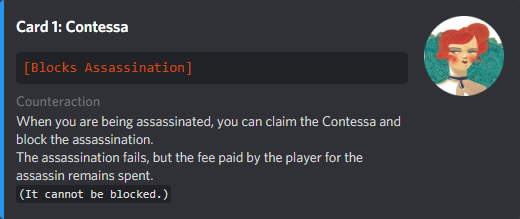

<h2 align="center">CoupBot (Golpinho)</h2>
 

  

## The game

Coup was developed by Rikki Tahta in 2012. This is an adaptation of the Brazilian version, published by Mandala Jogos.

> You are the head of a family in an Italian city-state run by a weak, corrupt and intriguing court. You are trying to control the city through manipulation, bluffing and bribery to come to power. Its aim is to destroy the influence of all other families, forcing them into exile. Only one family will survive...

 

## Commands

All commands begin with the prefix `[` and end with the suffix `]`

|  Command   | Description                                             |
| :--------: | ------------------------------------------------------- |
|  `[help]`  | All available commands                                  |
|  `[join]`  | Join the match                                          |
| `[leave]`  | Leave the match                                         |
|  `[list]`  | List all players in the match                           |
|  `[mode]`  | Select the game mode                                    |
| `[start]`  | Start the game                                          |
| `[board]`  | Shows the match situation                               |
| `[clear]`  | Remove all players from the match                       |
| `[rules]`  | Checks whether the server has the emojis and adds them. |
| `[emojis]` | Checks whether the server has the emojis and adds them. |

 

## Influences

All the cards have an incredible design, keeping all the essence of the original game. Each character has a different design that allows easy identification of the most important points. Below are some examples:

 

## Disclaimer

Note, me and CoupBot (Golpinho) have no right to the game we are adapting. This Bot is not being distributed for commercial purposes, but only for personal use. All IP (Intellectual Property) and Copyright rights in these images belong to their respective creators and rights holders. There is no association between Rikki Tahta or La Mame Games with this application. If you disagree with something or would like to claim any rights, please send me an email to [_<samduasvezesmortal@gmail.com>_](mailto:samduasvezesmortal@gmail.com) before taking any legal action. I am completely willing to remove any and all references to the original material, if necessary.
